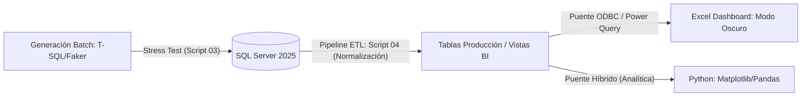

# **📘 Documentación Técnica – Proyecto P1_Inventario (V2.0 - Retrofitting)**
---

## 📌 Descripción general
Este proyecto fundamenta el rigor transaccional y la lógica de normalización, manejando deliberadamente datos **no atómicos** para simular entornos legacy. Se enfoca en la remediación mediante un pipeline ETL que transforma ruido en **Inteligencia de Negocio**.

---

### 🎯 Objetivo
*Generar un ecosistema capaz de ingerir y procesar un volumen de transacciones, demostrando eficiencia con una integración híbrida entre lenguajes de programación y motores de base de datos.



---

## **🏗️ Ciclo de Vida del Dato (Evolución Técnica)**

- **Fase 1: Arquitectura & Esquemas (Script 01)**
    - Segmentación por esquemas: `Inventario` (Maestros) y `Operaciones` (Transacciones).
    - Implementación de integridad referencial (`PK`, `FK`) y restricciones `CHECK` para calidad de origen.
  
- **Fase 2 y 3: Simulación de Carga Masiva (Scripts 02 y 03)**
    - Poblado de 500+ registros bajo estrés en < 2 segundos.
    - **Inyección de Datos Legacy:** Simulación intencional de datos compuestos (ej. `Mérida | YUC`) para probar el pipeline de limpieza.
  
- **Fase 4: Pipeline ETL & Data Grooming (Script 04) 💎**
    - **Normalización 1NF:** Extracción atómica de atributos mediante `SUBSTRING` y `CHARINDEX`.
  
    - **Data Grooming:** Estandarización de capitalización (Formato Título) y corrección universal de acentos.

    - **Idempotencia:** Script diseñado para correr múltiples veces sin degradar la calidad del dato.

- **Fase 5: Conectividad BI & Dashboard (Script 05)**
    - Vistas analíticas conectadas vía **ODBC** a Excel.
    - Visualización de métricas críticas: Stock debajo del mínimo, tendencias de venta y semáforos operativos.

---
## **📊 Indicadores de Performance Final**

| **Métrica**           | **Estado Anterior (Legacy)** | **Estado Optimizado (Post-ETL)** |
| :-------------------- | :--------------------------- | :------------------------------- |
| **Atomicidad**        | Atributos No Atómicos (`|`)  | 100% Primera Forma Normal (1NF)  |
| **Consistencia**      | Ruido Ortográfico (Acentos)  | Estandarización Global (Grooming)|
| **Performance Batch** | Carga no validada            | ~1,800 ms (500+ transacciones)   |
| **Conectividad BI**   | Datos aislados               | Bridge ODBC Activo (Excel)       |

---

## 📊 Ejemplo de métricas de ejecución (V1.0)

| **#** | **Dimensión**       | **Registros** | **Operación**                | **Performance** |
|:-----:|:-------------------:|:-------------:|:----------------------------:|:---------------:|
| 1     | Carga Transaccional | 3,200 (Total) | Inserción Masiva Aleatoria   | 1,776 ms        |
| 2     | Integridad          | 100 %         | Validación de PK/FK y CHECK  | Verificado      |
| 3     | Normalización       | 500 + filas   | Separación de Metadata (ETL) | < 1 s           |

---

## **📂 Estructura del Repositorio (Sincronizada)**

```text
P1_Inventario/
├── Dashboard/
│   └── 05_Dashboard_Operativo_P1.xlsx  # Reporte ejecutivo conectado vía ODBC.
├── img/                             # Capturas de pantalla y diagramas ERD
├── Scripts/
│   ├── 01_Setup_DDL.sql             # Arquitectura de tablas y esquemas.
│   ├── 02_DML_Seed.sql              # Datos semilla para validación inicial.
│   ├── 03_Procesamiento_Batch.sql   # Stress test y simulación de volumen.
│   ├── 04_ETL_Limpieza.sql          # Pipeline de normalización y Data Quality
│   └── 05_BI_Analytics.sql          # Capa de vistas para consumo externo.
└── Documentacion.md		          # Guía técnica del proyecto.
```

---

## **🛠️ Key Engineering Features**

- **Idempotencia:** Scripts diseñados con `DROP IF EXISTS` y validaciones `NOT EXISTS` para despliegues continuos.
- **Data Grooming:** Proceso automatizado de corrección de capitalización y limpieza de caracteres especiales.
- **Seguridad Transaccional:** Bloques `TRY…CATCH` con `ROLLBACK` automático para garantizar la integridad en cargas masivas.

---

## 🚀 Cómo Ejecutar

1. Clonar el repositorio.
2. Configurar el **DSN de Sistema** en el Administrador de Orígenes de Datos ODBC (Driver 17) apuntando a `P1_Inventario`.
3. Ejecutar los scripts en orden secuencial (**01 al 05**) en SQL Server Management Studio o VS Code.
4. Abrir el archivo `05_Dashboard_Operativo_P1.xlsx` y seleccionar **Datos > Actualizar Todo**.

---

## **🧠 Retos Técnicos y Soluciones de Ingeniería**

### Durante el desarrollo del Proyecto P1 (Inventario), se resolvieron desafíos críticos mediante estándares de la industria:

1. **Gestión de Identidades en Ciclos de Stress Test**
    - **Problema:** Las cargas masivas repetidas no reiniciaban los contadores `IDENTITY`, causando que los IDs crecieran indefinidamente y dificultando la validación de reportes legacy.
    - **Solución:** Se integró lógica de limpieza profunda que garantiza que cada ejecución del pipeline inicie desde el ID 1, asegurando la **repetibilidad de escenarios de prueba**.
    - **Impacto:** Facilitó la creación de benchmarks de rendimiento confiables y garantizó que las relaciones entre `Pedidos` y `Pagos` fueran siempre predecibles.
2. **Blindaje contra Propagación de Nulos (NULL Propagation)**
    - **Problema:** En la generación aleatoria de datos (Fase 3), funciones no deterministas como `CHOOSE` podían devolver `NULL`, rompiendo la integridad de las columnas `NOT NULL`.
    - **Solución:** Se implementó protección con `ISNULL(@Variable, 'Default')` y validaciones previas a la inserción.
    - **Impacto:** Se alcanzó un **100% de éxito en la ingesta masiva**, eliminando fallos por inconsistencias en la lógica de generación aleatoria.
3. **Normalización de Datos No Atómicos (ETL Robusto)**
    - **Problema:** Ingesta de datos "Legacy" en formatos compuestos como `Sucursal | Ciudad`. Esto impedía el filtrado y la agregación en el Dashboard.
    - **Solución:** Se diseñó un pipeline de limpieza basado en `SUBSTRING`, `CHARINDEX` y `TRIM`, sumado a una capa de **Data Grooming** para estandarizar acentos y capitalización de forma masiva.
    - **Impacto:** Transformó información cruda en **insumos analíticos puros**, permitiendo que el Dashboard de Excel agrupe ventas y stock de forma exacta sin duplicados por errores ortográficos.
4. **Métricas de Performance Transaccional**
    - **Problema:** Dificultad para cuantificar el impacto del procesamiento batch en el servidor.
    - **Solución:** Estandarización de logs de ejecución mediante `SYSUTCDATETIME()`, capturando el tiempo de proceso en milisegundos y el volumen de filas afectadas.
    - **Impacto:** Proporcionó **evidencia objetiva de rendimiento**, reportando cargas masivas exitosas en menos de 1,800 ms, facilitando la comunicación de resultados a nivel ejecutivo.

---

**📅 Próximos Pasos (Roadmap)**

- Implementar **Fuzzy Matching** para detección de ciudades no catalogadas.
- Automatizar el refresco del Dashboard mediante un `.bat` de ejecución diaria.

---

**Autor:** Alberto Dzib  
**Versión:** 2.1.0
