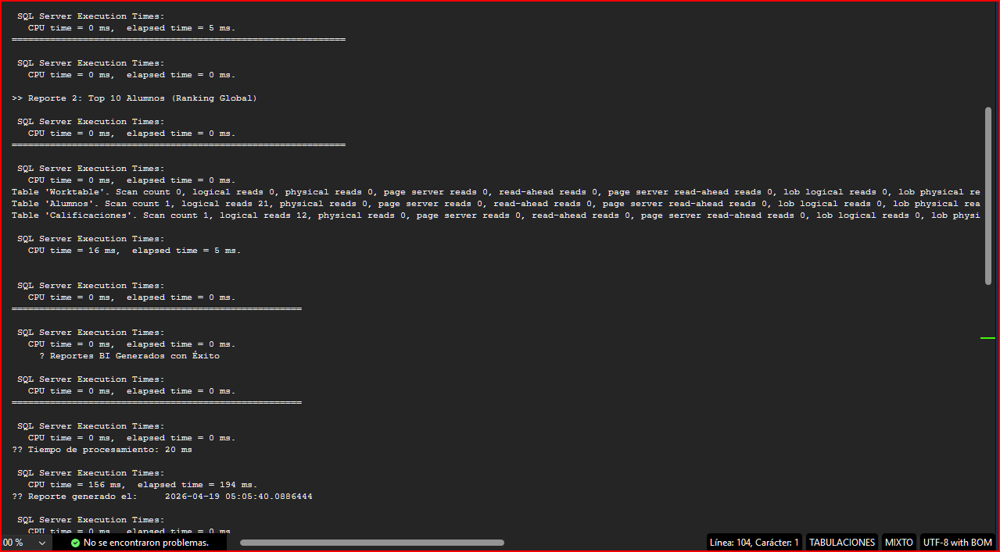

# 📑 Proyecto 2: Arquitectura de Datos Escolar - Resiliencia y Stress Testing

## 📌 Descripción general
* Proyecto 2 del Portafolio de SQL, enfocado en la creación de un sistema de gestión académica para una institución educativa ficticia. El proyecto abarca desde la creación de tablas y carga masiva de datos, hasta la limpieza y transformación de datos para generar reportes analíticos.

---

## 🎯 Objetivo
* Diseñar e implementar un pipeline de datos completo para la gestión escolar, demostrando habilidades avanzadas en **Arquitectura de Datos, Procesos ETL y Business Intelligence**.

---

## 🏗️ Arquitectura del Pipeline (01-05)
* El proyecto se divide en 5 etapas modulares, garantizando la escalabilidad y mantenibilidad:

1. **01_CreacionTablas:** DDL con esquemas (`Catalogos`, `Operaciones`) e integridad referencial.
2. **02_DatosIniciales:** Poblado de catálogos maestros con lógica de idempotencia.
3. **03_InsertMasivoDatos:** Carga de 1,000 alumnos y 2,000 notas con **Stress Testing** y transaccionalidad.
4. **04_LimpiezaDatos_ETL:** Transformación de datos no atómicos mediante **CTEs** y funciones de cadena.
5. **05_Reportes_BI:** Generación de KPIs y Cuadro de Honor con **Window Functions (RANK)**.

---

## 🛠️ Tecnologías y Estándares industriales
- **Entorno:** SQL Server 2025 | SSMS 22 | Git Flow.
- **Calidad:** Scripts Idempotentes (`DROP IF EXISTS`, `RESEED`).
- **Integridad:** Uso estricto de `DATETIME2`, `BEGIN TRY/CATCH` y `ROLLBACK`.
- **Métricas:** Logs detallados de tiempo de ejecución (ms) y filas afectadas.

---

## 📊 Evidencias de Ejecución
> Métricas finales obtenidas del Script 05.

---

## 📈 Rendimiento por Carrera (KPI Agregado)
>> Reporte 1: Promedios Generales por Carrera

| **#** | **Carrera**                | **TotalAlumnos** | **PromedioGeneral** | **NotaMinima** | **NotaMaxima** |
|:-----:|:--------------------------:|:----------------:|:-------------------:|:--------------:|:--------------:|
| **1** | Administración de Sistemas | 166.00           | 80.00               | 60.00          | 99.00          |
| **2** | Ciencias de la Computación | 167.00           | 79.72               | 60.00          | 99.00          |
| **3** | Ingeniería de Datos        | 167.00           | 79.67               | 60.00          | 99.00          |

### 📈 Ranking Académico (Top 10) 🚀

>> Reporte 2: Cuadro de Honor 

| **#**  | **Posicion** | **Nombre**        | **Carrera**                | **PromedioFinal** |
|:------:|:------------:|:-----------------:|:--------------------------:|:-----------------:|
| **1**  | 1            | Estudiante_ID_937 | Ciencias de la Computación | 95.75             |
| **2**  | 2            | Estudiante_ID_678 | Ingeniería de Datos        | 95.50             |
| **3**  | 3            | Estudiante_ID_580 | Ciencias de la Computación | 95.00               |
| **4**  | 4            | Estudiante_ID_761 | Administración de Sistemas | 93.25             |
| **5**  | 4            | Estudiante_ID_607 | Ciencias de la Computación | 93.25             |
| **6**  | 6            | Estudiante_ID_897 | Ingeniería de Datos        | 92.75             |
| **7**  | 6            | Estudiante_ID_505 | Ciencias de la Computación | 92.75             |
| **8**  | 8            | Estudiante_ID_720 | Ingeniería de Datos        | 92.25             |
| **9**  | 8            | Estudiante_ID_551 | Administración de Sistemas | 92.25             |
| **10** | 8            | Estudiante_ID_976 | Ciencias de la Computación | 92.25             |

---

## 🚀 Cómo Ejecutar
1. Clonar el repositorio.
2. Ejecutar los scripts en orden secuencial (01 al 05) en SQL Server.
3. Consultar la vista `Operaciones.VW_Alumnos_Normalizados` para ver los datos limpios.

---

## 🧠 Retos Técnicos y Soluciones de Ingeniería

### Durante el desarrollo del Proyecto 2 (Escolar), se enfrentaron desafíos técnicos de nivel avanzado que fueron resueltos mediante estándares de la industria:

1. **Gestión de Identidades en Pruebas de Estrés**
- **Problema:** Al ejecutar cargas masivas repetidas, los contadores `IDENTITY` no se reiniciaban con el comando `DELETE`, causando inconsistencias en las llaves foráneas y fallos en la lógica de filtrado.
- **Solución:** Se implementó `DBCC CHECKIDENT ('Tabla', RESEED, 0)` para garantizar que cada ejecución del pipeline inicie con una base de datos limpia y predecible desde el ID 1.
- **Impacto:** La gestión correcta de identidades en pruebas de estrés permitió mantener la **consistencia referencial** en todas las ejecuciones, evitando errores críticos en llaves foráneas y asegurando resultados confiables. Este ajuste incrementa la **robustez del pipeline**, facilita la **repetibilidad de escenarios de prueba** y aporta mayor **credibilidad a los benchmarks de rendimiento**.  
Esto garantiza **consistencia en las llaves foráneas**, elimina fallos en la lógica de filtrado y permite **pipelines confiables y repetibles** en entornos de carga masiva.
2. **Manejo de Desbordamiento Aritmético (Overflow)**
- **Problema:** Durante la generación de datos aleatorios, el cálculo de notas generaba valores de `100.00`, excediendo la precisión definida de `DECIMAL(4,2)` (máximo 99.99).
- **Solución:** Se ajustó la lógica de generación aleatoria mediante operadores de módulo (`%`) y se envolvió el proceso en bloques `BEGIN TRY/CATCH` para asegurar que el sistema nunca quede en un estado inconsistente (Rollback automático).
- **Impacto:** Se garantizó el 100% de la integridad de los datos financieros/académicos evitando detenciones en el pipeline.
3. **Procesamiento de Datos No Atómicos (ETL)**
- **Problema:** Ingesta de datos "sucios" en una sola columna con formato `Fecha|Estatus|Promedio`, lo cual impedía el análisis numérico y temporal.
- **Solución:** Se diseñó una capa de transformación mediante Common Table Expressions (CTEs) anidadas y funciones de cadena (`CHARINDEX`, `SUBSTRING`). Esto permitió separar y convertir los datos a tipos `DATETIME2` y `DECIMAL`, creando una Vista Operativa lista para Business Intelligence.
- **Impacto:** La normalización de datos no atómicos permitió transformar información cruda en **insumos analíticos confiables**. Este proceso habilitó la **trazabilidad temporal**, el cálculo preciso de métricas y la creación de una **vista operativa lista para BI**, elevando la calidad de los reportes y la capacidad de tomar decisiones estratégicas.
4. **Automatización y Métricas**
- **Problema:** Dificultad para medir el impacto de rendimiento en procesos masivos.
- **Solución:** Se estandarizó el uso de `SYSUTCDATETIME()` y `DATEDIFF` en todos los scripts, proporcionando logs de ejecución profesionales que informan el tiempo de proceso en milisegundos y el volumen de filas afectadas.
- **Impacto:** La estandarización de métricas permitió convertir cada proceso masivo en una **fuente confiable de evidencia de rendimiento**. Con registros uniformes de tiempo y volumen de filas, se logró una **medición objetiva del impacto**, facilitando la **comparación entre pipelines**, la **detección temprana de cuellos de botella** y la **comunicación clara de resultados a nivel ejecutivo**.

---

**Autor:** Alberto Dzib  
**Versión:** 2.2.0
