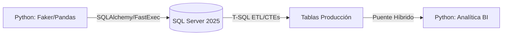
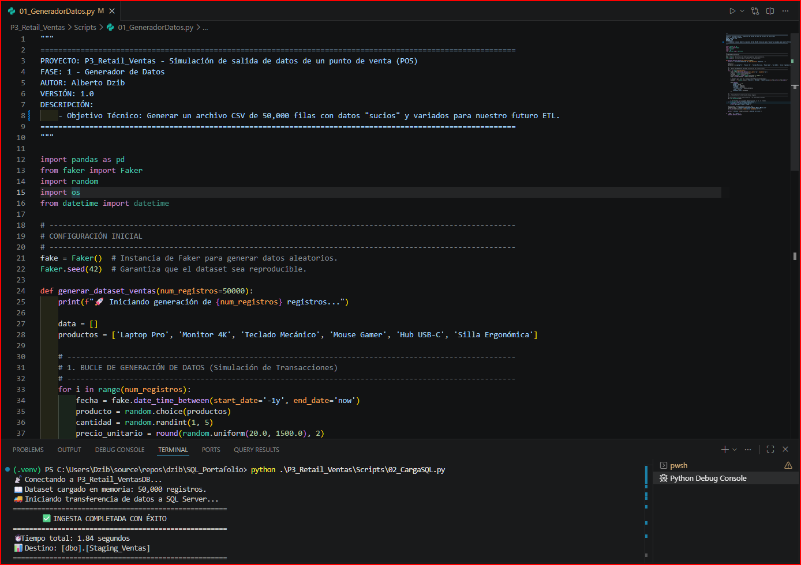

# 🐍 Proyecto 3: Pipeline Híbrido Retail/Ventas (Python + SQL Server)

## 📌 Descripción General
* Implementación de una arquitectura híbrida avanzada para el procesamiento de Big Data, integrando Python como motor de orquestación y generación de datos, y SQL Server 2025 como motor de almacenamiento masivo, limpieza y normalización.
* Arquitectura diseñada para alta disponibilidad, capaz de escalar de 50k a 1M de registros manteniendo una tasa de ingesta de ~27,000 registros por segundo.

---

### 🎯 Objetivo
* Diseñar un ecosistema capaz de generar, ingerir y procesar un volumen de 50,000 transacciones en tiempo récord, demostrando la eficiencia de la integración híbrida entre lenguajes de programación y motores de base de datos.

---

### 🏗️ Arquitectura Híbrida (Ecosistema estructurado)
*El proyecto se divide en 3 fases críticas de ingeniería:

---
1. 01_GeneradorDatos (Python): Generación de dataset sintético de 50,000 registros mediante la librería `Faker`, utilizando semillas de reproducibilidad.
2. 02_CargaSQL (Python): Ingesta masiva optimizada mediante SQLAlchemy y `fast_executemany` (Tasa de transferencia: ~27k reg/seg).
3. 01_Estructura_P3 (SQL): Diseño de esquemas normalizados (`Ventas`, `Catalogos`) y arquitectura relacional blindada.
4. 02_CargaLimpieza_P3 (SQL): Proceso ETL masivo con resolución de conflictos `DDL/DML` de llaves únicas y materialización de columnas.
5. 03_LimpiezaMetadata_P3 (SQL): Optimización de Esquema: Se implementa la materialización de datos mediante `ALTER TABLE` y un proceso de `UPDATE` masivo orquestado por una `CTE`. Se transita de una estructura de 'Staging' a una tabla de producción altamente eficiente, aplicando funciones de cadena.
6. 03_Analitica_Ventas (Python): Integración Híbrida exitosa, se valida la arquitectura de 'Puente de Datos' logrando tiempos de respuesta sub-segundo (`0.53s`) en la generación de reportes de negocio Dashboard de BI en consola con formateo profesional de KPIs y consumo directo desde SQL.

---

### 📊 Evidencias de Rendimiento y Analítica
* 📑 Métricas de Ingesta: Carga masiva completada en 1.84 segundos.

* 📈 Métricas de Analítica: Reporte generado en 0.537 segundos.

---

### 🏆 Cuadro de Honor: TOP 5 Vendedores (Ranking Global)
> Análisis de desempeño basado en un volumen de 50,000 transacciones.
| **#** | **Vendedor**   | **Ventas Totales** | **Cant. Transacciones** | **Ticket Promedio** |
|:-----:|:--------------:|:------------------:|:-----------------------:|:-------------------:|
| **1** | Daniel Smith   | $44,820.80         | 15                      | $2,988.05           |
| **2** | James Johnson  | $43,332.19         | 14                      | $3,095.16           |
| **3** | David Smith    | $42,933.17         | 15                      | $2,862.21           |
| **4** | David Brown    | $39,371.30         | 12                      | $3,280.94           |
| **5** | Amanda Johnson | $38,703.72         | 18                      | $2,150.21           |

### 💳 Preferencias de Pago

| **#** | **Método de Pago** | **Frecuencia** |
|:-----:|:------------------:|:--------------:|
| **1** | Tarjeta            | 16,476         |
| **2** | Efectivo           | 16,874         |
| **3** | Transferencia      | 16,650         |

---
### 🧠 Retos Técnicos y Soluciones de Ingeniería
1. *Sincronización de Middleware:*
   - *Problema:* Establecer una conexión persistente y segura entre el entorno virtual de Python y SQL Server 2025.
   - *Solución:* Configuración exitosa de ODBC Driver 17 y SQLAlchemy, permitiendo un flujo de datos bidireccional sin latencia.
2. *Afinamiento de Infraestructura Local (I/O):*
   - *Problema:* Riesgo de cuellos de botella durante la escritura de 50k registros en el disco del sistema.
   - *Solución:* Expansión del volumen lógico del SSD (C:) y optimización del "Write Caching", logrando una mejora drástica en los tiempos de respuesta.
3. *Colisiones de Unique Key (DDL/DML):*
   - *Problema:* Violación de restricciones de unicidad en el catálogo de productos debido a variaciones de precio en el origen.
   - *Solución:* Implementación de lógica de agregación MAX() y agrupamiento GROUP BY en la fase de carga SQL para asegurar la integridad referencial.
4. *Captura de Métricas en Lotes Segmentados:*
   - *Problema:* Pérdida de contexto en variables de sistema como @@ROWCOUNT tras instrucciones DDL.
   - *Solución: Uso estratégico del comando GO para separar lotes y captura inmediata de métricas para garantizar la trazabilidad total del proceso ETL.

----

*Autor:* Alberto Dzib
*Versión:* 3.0.0