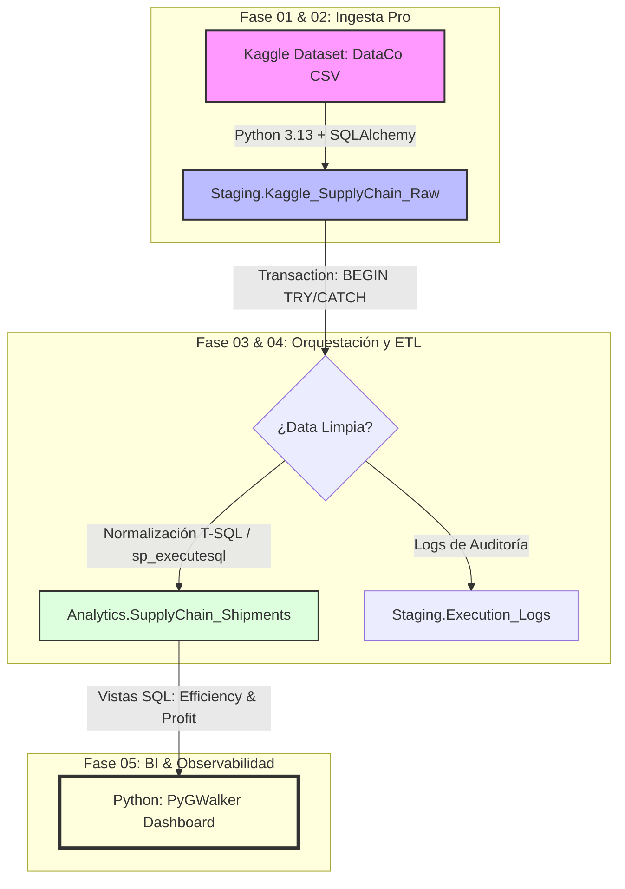
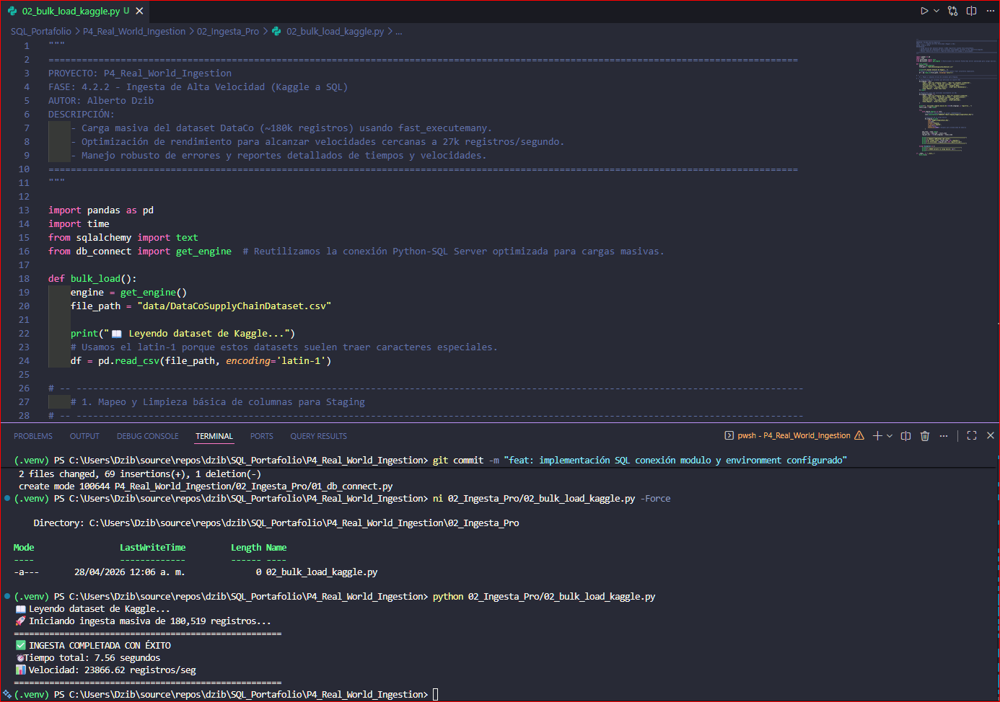
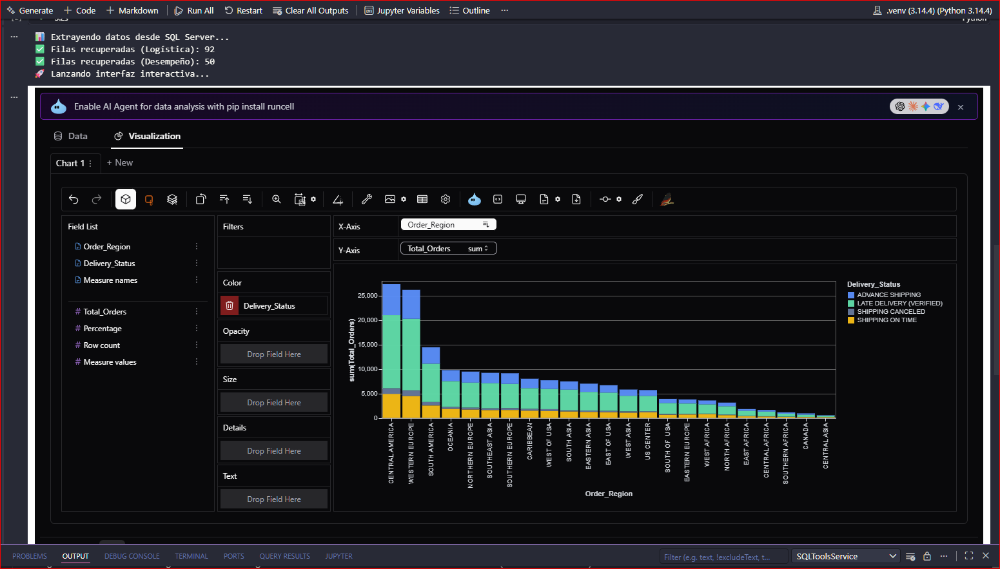
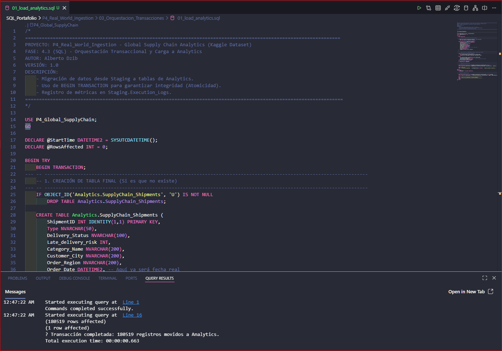

# 💎 P4: Real-World Global Supply Chain Ingestion 🧮
**Estado:** ✅ Finalizado (FASE V4.5) 🏆
---

## 🎯 Objetivo
Orquestar un pipeline híbrido de alto rendimiento para procesar datasets reales de DataCo Global Supply Chain, integrando Python 3.13 para la carga masiva y SQL Server 2025 para la transformación y analítica avanzada.

## 🚀 Retos Técnicos a Resolver
- **Ingesta Masiva:**  Alcanzada una tasa de 23.8k reg/seg (180k registros en 7.5s).
- **Data Cleansing:** Normalización y detección de anomalías mediante **T-SQL Dinámico.**
- **Observabilidad:** Implementación de logs narrativos y métricas de performance en tiempo real.

## 🏗️ Estructura del Proyecto (Pipeline 01-05)
1. **01_Setup_DDL:** Esquemas y constraints nominados.
2. **02_Ingesta_Pro:** Orquestación con `SQLAlchemy` + `fast_executemany`.
3. **03_Orquestacion_Transacciones:** Manejo de atomicidad con `TRY`/`CATCH`.
4. **04_ETL_Cleaning:** Normalización, estandarización y auditoría financiera.
5. **05_BI_Observabilidad:** Análisis de desempeño logístico interactivo.

---

## 📊 Evidencia Cuantitativa y Visual
*Resumen de la ingesta.

| **Métrica**               | **Resultado**     |
|:-------------------------:|:-----------------:|
| **Volumen Total**         | 180,519 registros |
| **Tiempo de Ingesta**     | 7.56 segundos     |
| **Tasa de Transferencia** | 23,866.62 reg/seg |

## 📸 Galería de Hitos:

+ Figura 1: Registro de performance en Python durante la carga masiva.

+ Figura 2: Dashboard interactivo de eficiencia logística (PyGWalker).

+ Figura 3: Ejecución de carga transaccional en SQL Server.

---

## 📝 Bitácora de Troubleshooting (🧠 Retos Superados)

**1. Scope de Variables en Lotes SQL (`GO`)**
  - **Reto:** Pérdida de la variable @StartTime tras usar la palabra clave GO.
  - **Causa:** `GO` finaliza el lote actual, limpiando el scope de variables declaradas.
  - **Solución:** Reestructuración de bloques para declarar variables dentro del mismo lote de ejecución o evitar `GO` innecesarios en bloques transaccionales.

**2. Sincronización de Metadatos (IntelliSense)**
  - **Reto:** VS Code marca error en tablas recién creadas.
  - **Solución:** Ejecución de `Ctrl + Shift + P` -> "MS SQL: Refresh IntelliSense Cache" para forzar la actualización de la caché del servidor de lenguaje.

**3. Sincronización de Kernels en Jupyter**

  - **Reto:** Módulo `pandas` no encontrado a pesar de estar en `.venv`.
  - **Solución:** Uso de comandos mágicos `%pip install` dentro del propio notebook para forzar la vinculación del kernel con el sitio de paquetes del entorno virtual.

**4. Dependencias y Default Constraints**

  - **Reto:** Error al intentar eliminar columnas con valores predeterminados (Is_Anomaly).
  - **Causa:** SQL Server impide el borrado de columnas con objetos dependientes activos.
  - **Solución:** Implementación de **SQL Dinámico** (`sp_executesql`) para manejar la existencia de columnas y constraints de forma elástica sin romper el pipeline.

**5. Sincronización de Dependencias en Jupyter Kernels**

  - **Reto:** El Kernel del Notebook no reconocía el módulo `pandas` a pesar de estar instalado en el `.venv`.
  - **Causa:** En entornos Windows, Jupyter a veces no vincula correctamente el *site-packages* del entorno virtual hasta que se realiza una instalación interna o se reinicia el proceso del kernel.
  - **Solución "Quick-Fix":** Uso del comando mágico `%pip install` dentro de una celda del propio Notebook para forzar la instalación y reconocimiento de librerías exactamente en el Kernel activo.

**6. Integridad de Datos: El problema de los NULLs en columnas con DEFAULT**

  - **Reto:** Error de división por cero (`ZeroDivisionError`) en la capa de visualización (PyGWalker) debido a filtros que excluían registros inesperadamente.
  - **Lección Aprendida:** Al agregar una columna `BIT` con un `DEFAULT constraint`, SQL Server solo aplica el valor predeterminado a las **nuevas** inserciones. Los 180k registros existentes quedaron con valor `NULL`.
  - **Solución (Hotfix):** Implementación de un script de reparación (`UPDATE`) para normalizar los valores `NULL` a `0`, asegurando la integridad de los filtros en las vistas analíticas y el correcto funcionamiento del dashboard.

---

**🌳 Git Flow & Infraestructura**

- **Higiene:** Centralización de `.gitignore` en la raíz para protección de datos pesados (100MB+).
- **Git Flow:** Ramas `feature` integradas a `main` tras validación exitosa de QA.
- **Hardware Aware:** Gestión manual de servicios SQL vía scripts `.bat` para optimización de recursos locales.

---

*Autor:* Alberto Dzib
*Versión:* 1.0.0