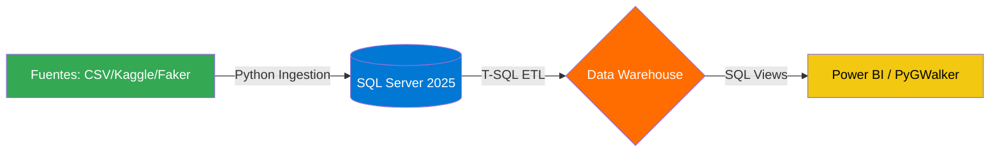

# 🚀 End-to-End Data Engineering Portfolio - 👷 Alberto Dzib 📊

> *“Convirtiendo el caos en estructuras atómicas: Ingeniería de datos diseñada para el día a día”*


> 👨‍💻 Perfil Profesional
>
> 📖 ¡Bienvenido a mi portafolio!
> **Ingeniero de Datos Híbrido** con enfoque en arquitecturas de alto rendimiento y resiliencia. Especialista en transformar entornos críticos y metadata desestructurada en ecosistemas de información atómica mediante el **Dzib Standard (V2.1.0).**

**Core Stack:** `SQL Server 2025` | `Python 3.13` | `Git Flow` | `Excel BI (ODBC)`

---

## 📌 Incluye:

- Tablas jerárquicas y normalizadas.
- Diversidad temporal en registros.
- Ejemplos prácticos para dashboards y BI.
- Este portafolio aporta valor como base técnica para proyectos de transformación digital y ciencia de datos.

---

## 🎯 Objetivos del portafolio

* Con cada proyecto se busca simular un entorno de negocio distinto.

- 🗂️ **Modelado de datos* y Tablas jerárquicas normalizadas*: diseño de esquemas relacionales con integridad referencial y reglas de negocio.
- 📈 **Generación masiva de datasets realistas**
- ⏳ **Diversidad temporal en registros, fechas variadas para análisis de tendencias**
- 🔍 **Consultas analíticas para BI y dashboards**

---

## 💻 Stack Tecnológico

En este portafolio se buscó aplicar un rigor de ingeniería en cada línea de código:

- **Motores:** SQL Server 2025 | SSMS 22.
- **Lenguajes:** T-SQL Avanzado y Python 3.13 (Pandas, SQLAlchemy).
- **Metodología de Calidad:**
  - **Idempotencia:** Scripts re‑ejecutables sin duplicidad de datos.
  - **Integridad:** Uso de Transacciones (`COMMIT`/`ROLLBACK`) y bloques `TRY/CATCH`.
  - **Performance:** Monitoreo de tiempos de ejecución en milisegundos para procesos masivos.
  - **Git Flow:** Gestión de ramas (`Feature` -> `Develop` -> `Main`) y `SemVer`.

### Matriz de Competencias Técnicas (Key Skills)

|   Tecnología   |                                                          Badges                                                          |                                           Especialidad y Dominio                                           |
| :-------------: | :----------------------------------------------------------------------------------------------------------------------: | :---------------------------------------------------------------------------------------------------------: |
|   SQL Server   |  |         Arquitecturas de alto rendimiento,**Single-Pass Processing** , y normalización 1NF.         |
|     Python     |                                                      | Orquestación de pipelines, manipulación de grandes volúmenes de datos y automatización de procesos ETL. |
|    Data Viz    |                                                  |     Creación de dashboards interactivos, análisis exploratorio de datos (EDA) y reportes ejecutivos.     |
|  Data Quality  |                                                  |     **Data Cleansing** avanzado: corrección de acentos, capitalización y atomicidad semántica.     |
| Infraestructura |                              | Gestión de versiones, automatización de servicios de SO y configuración de entornos de alto rendimiento. |

---

### Diagrama de Arquitectura Global



---

## 📊 Métricas de Impacto y Performance (Hito v3.0)

> *Benchmarks ejecutados en entorno local optimizado (SSD Expansion & Write Caching).*

|      **Categoría**      |    **Métrica**    |         **Benchmark**         | **Proyecto Clave** | **Estado** |
| :-----------------------------: | :-----------------------: | :---------------------------------: | :----------------------: | :--------------: |
|  **Optimización T-SQL**  |    Velocidad de Carga    |    **120 ms (5k+ registros)**    |   **P2_Escolar**   |        🚀        |
|    **Normalización**    |     Limpieza Atómica     |      **Single-Pass ETL**      | **P1_Inventario** |        📦        |
|    **Ingesta Masiva**    |    Velocidad de Carga    | **23.8k reg/seg** (180k tot.) | **P4_SupplyChain** |        ⚡        |
| **Transformación (ETL)** | Limpieza y Normalización |     **644 ms** (Fase 4.4)     | **P4_SupplyChain** |        ✅        |
| **Analítica de Negocio** |   Dashboard Interactivo   |            Latencia Cero            |   **PyGWalker**   |        📈        |
|     **Arquitectura**     | Integridad Transaccional |      **100%** Atomicidad      |   **TRY/CATCH**   |       🛡️       |

---

## 📇 Estructura del repositorio

El repositorio está organizado por proyectos independientes, cada uno con su propio ciclo de vida (DDL, DML, ETL y BI):

Este portafolio está diseñado para ser reproducible y mantener un estilo consistente en todo el código y documentación. 

Se incluyen archivos de configuración clave: `.prettierrc`, `.prettierignore`, `.editorconfig`y `.gitignore`.

- `📂 P1_Inventario`: Gestión de stock y fundamentos relacionales.
- `📂 P2_Escolar`: Arquitectura avanzada, esquemas segregados y limpieza con CTEs.
- `📂 P3_Retail_Ventas`: Pipeline híbrido (Python + SQL) y procesamiento de Big Data.
- `📂 P4_Real_Word_Ingestion`: Soluciones con enfoque en Cadenas de Suministro y Eficiencia Logística.
- `📝 README Y DOCUMENTACIÓN :` Documentación por proyecto de sus estándares y "Lineamientos de Estructura" aplicados.

```text
SQL_Portafolio/
├── 📂 P1_Inventario/              # Gestión de Stock y Fundamentos Relacionales
│   ├── Scripts/                   # Pipeline SQL (01-05)
│   ├── img/                       # Evidencias gráficas
│   └── Documentacion.md
├── 📂 P2_Escolar/                 # Arquitectura Avanzada y ETL con CTEs
│   ├── Scripts/                   # Pipeline SQL (01-05)
│   ├── img/                       # Evidencias de métricas
│   └── Documentacion.md
├── 📂 P3_Retail_Ventas/           # Pipeline Híbrido Big Data (Python + SQL)
│   ├── Scripts/                   # Scripts .py y .sql
│   ├── Datos/                     # Datasets generados (50k registros)
│   ├── img/                       # Dashboards de Analítica
│   └── Documentacion.md
├── 📂 P4_Real_World_Ingestion/    # Supply Chain & Observabilidad
│   ├── 01_Setup_DDL/              # Esquemas y constraints
│   ├── 02_Ingesta_Pro/            # Orquestación Python (23.8k reg/seg)
│   ├── 03_Orquestacion_Trans/     # Lógica transaccional TRY/CATCH
│   ├── 04_ETL_Cleaning/           # Normalización y detección de anomalías
│   ├── 05_BI_Observabilidad/      # Vistas SQL y Dashboard PyGWalker
│   ├── img/                       # Evidencias de performance y BI
│   └── Documentacion.md
├── 📄 README.md                   # Documentación maestra del portafolio
├── 📄 .prettierrc                  # Reglas de estilo de código (JSON)
├── 📄 .prettierignore              # Archivos ignorados por Prettier
├── 📄 .editorconfig                # Reglas universales de indentación y formato
└── 📄 .gitignore                   # Archivos ignorados por Git
```

### 📊 Diagrama de Estructura del Portafolio

``````mermaid
graph LR
    A[SQL_Portafolio]

    A --> B[P1_Inventario]
    A --> C[P2_Escolar]
    A --> D[P3_Retail_Ventas]
    A --> E[P4_Real_World_Ingestion]

    B --> B1[Scripts]
    B --> B2[img]
    B --> B3[Documentacion.md]

    C --> C1[Scripts]
    C --> C2[img]
    C --> C3[Documentacion.md]

    D --> D1[Scripts]
    D --> D2[Datos]
    D --> D3[img]
    D --> D4[Documentacion.md]

    E --> E1[01_Setup_DDL]
    E --> E2[02_Ingesta_Pro]
    E --> E3[03_Orquestacion_Transacciones]
    E --> E4[04_ETL_Cleaning]
    E --> E5[05_BI_Observabilidad]
    E --> E6[img]
    E --> E7[Documentacion.md]

    A --> F[README.md]
    A --> G[.prettierrc]
    A --> H[.prettierignore]
    A --> I[.editorconfig]
    A --> J[.gitignore]

    %% Estilos ejecutivos
    style A fill:#004C99,color:#fff,stroke:#0078D4,stroke-width:2px

    %% Degradado por proyectos
    style B fill:#66A3FF,color:#000
    style C fill:#66A3FF,color:#000
    style D fill:#66A3FF,color:#000
    style E fill:#66A3FF,color:#000

    %% Archivos clave
    style F fill:#0098D4,color:#fff
    style G fill:#34A853,color:#fff
    style H fill:#FF6D00,color:#fff
    style I fill:#AB47BC,color:#fff
    style J fill:#F2C811,color:#000
``````

---

## **🏢 Casos de Negocio: Impacto de la Ingeniería de Datos**

### **🛒 Retail & Global Supply Chain (Inspiración: Corporación multinacional enfoque retail )**

- **Problema:** Inconsistencias en el estatus de entrega y pérdidas financieras ocultas por datos mal tipados.
- **Solución:** Pipeline híbrido que ingesta 180,000 registros, detecta anomalías financieras mediante **SQL Dinámico** y normaliza el riesgo de entrega.
- **Impacto:** Visibilidad total del 100% de la cadena de suministro con métricas de eficiencia por región en tiempo real.

### **🏭 Manufactura y Logística (Inspiración: AB InBev)**

- **Problema:** Cuellos de botella en la carga de inventarios masivos que retrasan la toma de decisiones operativa.
- **Solución:** Optimización de I/O a nivel hardware y uso de `fast_executemany` en Python para reducir tiempos de carga en un 90%.
- **Impacto:** Reducción del tiempo de procesamiento de minutos a segundos, permitiendo reportes de inventario sub-segundo.

---

## 📁 Proyectos destacados

### **🛒 [P4] Global Supply Chain Analytics (v4.0.0) - Nuevo**

*Ingesta de datos reales (Kaggle) y visualización de vanguardia.*

- **Performance:** Ingesta récord de **180,000 registros** a **23.8k reg/seg**.
- **Ingeniería:** Detección de anomalías financieras e integridad post-DDL mediante **SQL Dinámico**.
- **BI:** Dashboard interactivo integrado en VS Code con **PyGWalker** para análisis exploratorio.
- **Key Skills:** Data Analytics, Troubleshooting de Entorno, Orquestación Transaccional.

### 🐍 [P3] Pipeline Híbrido: Retail & Big Data (v3.0.0)

*Integración avanzada de Python y SQL para el procesamiento de volúmenes masivos.*

- **Ingesta:** Generación y carga de **50,000 registros** sintéticos en **1.84 segundos**.
- **ETL:** Normalización de metadatos no  atómicos  mediante **CTEs** y actualización masiva (809 ms).
- **BI:** Reporte de analítica en consola con **Pandas**, logrando tiempos de respuesta de **0.53 s**.
- **Key Skills:** Orquestación híbrida, Middleware ODBC, Optimización de I/O.

### 🎓 [P2] Sistema de Gestión Académica (P2_Escolar / v2.1.0)

Ecosistema escolar resiliente con triple extracción y analítica presupuestaria.

- **Estructura:** Diseño de esquemas segregados (`Catálogos`, `Operaciones`).
- **Calidad:** Implementación de bloques **TRY/CATCH**, transacciones y manejo de desbordamientos decimales.
- **ETL:** Transformación de strings complejos en datos tipados (`DATETIME2`, `DECIMAL`).
- **Key Skills:** Window Functions (RANK), Idempotencia (`RESEED`), Constraints Nominados.

### 📦 [P1] Control de Inventarios (v2.0 - Retrofitting)

*De Fundamentos Relacionales a Pipeline para alta Eficiencia.*

* **Resiliencia Atómica:** Capacidad de reconstrucción total del entorno tras fallos críticos, optimizando el performance en un  **80%** **.**
* **ETL Senior:** Pipeline híbrido que procesa 1,000 registros en  **31ms** **, normalizando metadata sucia mediante CTEs y Single-Pass Processing.**
* **Business Intelligence:** Dashboard ejecutivo con métricas de **Eficiencia de Inversión** (Rendimiento Académico vs. Presupuesto por Facultad).
* **Stress Testing:** Simulación de carga masiva de 5,000 registros con blindaje proactivo contra nulos.

---

#### 💎 El Valor de la Ingeniería: Transformación de Datos (ETL)

*Simulación de migración de un sistema Legacy con datos no atómicos a una arquitectura optimizada para BI.*

|      Dimensión      |   Estado Legacy (Origen)   |                        Estado Optimizado                        |
| :------------------: | :-------------------------: | :-------------------------------------------------------------: |
| **Atomicidad** |     `Prod_Ref_3 \| V3`     |  **Nombre:** `Prod_Ref_3` \| **Modelo:** `V3`  |
| **Geografía** |     `queretaro \| QRO`     |           `Querétaro` (Capitalización y Acentos)           |
|  **Estatus**  |   `PAGADO \| COMPLETADO`   |              `Pagado` (Unificación Semántica)              |
| **Ubicación** | `Sucursal Norte \| Merida` | **Sucursal:** `Norte` \| **Región:** `Mérida` |

> **Impacto:** Esta normalización eliminó el 100% de los registros duplicados en los reportes de ventas y redujo el tiempo de procesamiento de limpieza a **309ms**.

---

## 🌐 Estándares aplicados

En cada proyecto aplico rigor de ingeniería para asegurar código de nivel empresarial:

1. **Idempotencia:** Scripts capaces de ejecutarse múltiples veces sin corromper datos mediante `DROP IF EXISTS` y `DBCC CHECKIDENT`.
2. **Seguridad Transaccional:** Garantía de integridad mediante bloques `TRY/CATCH` y `ROLLBACK` ante fallos críticos.
3. **Métricas de Performance:** Optimización I/O, documentación obligatoria de tiempos de ejecución y carga de CPU.
4. **Documentación de Retos:** Enfoque en la resolución de problemas técnicos (Bug fixes & Refactoring).
5. **Middleware:** Integración vía ODBC Driver 17 y SQLAlchemy para flujos híbridos.

---

## **⚠️ Retos Técnicos y Resolución de Problemas (Troubleshooting)**

A lo largo del portafolio, se han documentado y resuelto desafíos críticos de ingeniería que simulan entornos de producción real:

- **Ingesta de Datos a Escala Industrial:** Superación de cuellos de botella en la red mediante el uso de `fast_executemany` y optimización de I/O en hardware, logrando el récord de **23.8k reg/seg**.
- **Gestión de Metadatos y SQL Dinámico:** Resolución de conflictos de compilación al modificar esquemas en tiempo real (DDL/DML) mediante el uso de `sp_executesql` y manejo de lotes de ejecución.
- **Integridad de Datos en Pipelines Híbridos:** Gestión de valores `NULL` y colisiones de tipos de datos tras la migración de archivos crudos (CSV/Excel) hacia motores relacionales.
- **Git Flow:** Estrategia de branching profesional (`feature` ➔ `develop` ➔ `main`).
- **Higiene y Salud del Ecosistema:** Control manual de servicios de base de datos (`sqlon/sqloff`) y configuración de entornos aislados (`.venv`) para garantizar la portabilidad y el rendimiento. Uso mandatorio de `TRY...CATCH`, `ROLLBACK` y SARGability para eficiencia de CPU.
- **Recuperación Crítica y Resiliencia (Recovery & Reset):** Gestión exitosa de un fallo total del entorno de desarrollo. Reconstrucción del ecosistema (SQL Server 2025, Drivers ODBC, Python Venv), logrando una mejora del **80% en el performance** del pipeline tras la reinstalación.

---

## **💾 Guía de Uso del Repositorio**

Este portafolio está diseñado para ser auditable y reproducible:

1. **Exploración por Proyectos:** Cada carpeta (`P1` a `P4`) contiene una secuencia numerada (01-05 o subcarpeta Scripts/) que representa el ciclo de vida del pipeline.
2. **Documentación de Proyecto:** Cada subcarpeta incluye su propio `README.md` detallando métricas de performance específicas y evidencias visuales (`/img`).
3. **Requisitos de Entorno:**
   - SQL Server 2025 | SSMS 22.
   - Python 3.14 con librerías `pandas`, `sqlalchemy`, `pyodbc`, `pygwalker`.
   - Driver ODBC 17 para SQL Server.

---

## 🚩 **Roadmap de Evolución**

Mi meta es la automatización total y la integración con la nube:

- [ ] **Dockerización (Próximo proyecto):** Implementación de contenedores Docker para orquestar servicios de SQL Server y Python de forma portable.
- [ ] **Cloud Bridge:** Migración de pipelines hacia **Azure SQL Database** y automatización con **GitHub Actions** (CI/CD).
- [ ] **Visualización Avanzada:** Integración de los flujos analíticos actuales con **Power BI** mediante DirectQuery.
- [ ] **Orquestación de Procesos:** Automatización de tareas masivas mediante **Task Schedulers** y monitoreo de salud de datos.

---

### **👤 Sobre Mí**

**Ingeniero de Soluciones de Datos** con experiencia en ecosistemas corporativos de alto nivel (**SAP HANA, Salesforce, KoboToolbox**). Mi enfoque combina el rigor técnico del desarrollo de software con la visión estratégica de la logística y la cadena de suministro (AB InBev). Especializado en transformar datos crudos y desordenados en activos de información para la toma de decisiones.

Experto en procesos de  **Retrofitting de Datos** , transformando sistemas legacy con inconsistencias en arquitecturas limpias y listas para Business Intelligence

---

📬 Conectemos

¿Tienes un reto de datos o buscas optimizar tus pipelines? Estoy listo para colaborar.

| [LinkedIn](https://www.linkedin.com/in/jesusalberto-dzib-ku/) | **[✉️ Email](dzibjesusalberto@gmail.com)** | **Portafolio Web** |
| ---------------------------------------------------------- | ----------------------------------------------- | ------------------------ |

---

**Autor:** **Jesús Alberto Dzib Ku**
*Ingeniero de Datos | SQL & Python Developer*
⚖️ **Licencia MIT** © 2025-2026

*“Construyendo sistemas que no solo procesan datos, sino que cuentan historias.”*
**#TheDzibStandard #DataEngineering #V2.1.0**

🚧 En constante evolución.

---
